# Dev-Ops-08 Multi-OS Hybrid Data Resilience & Preventive Disaster Recovery Platform

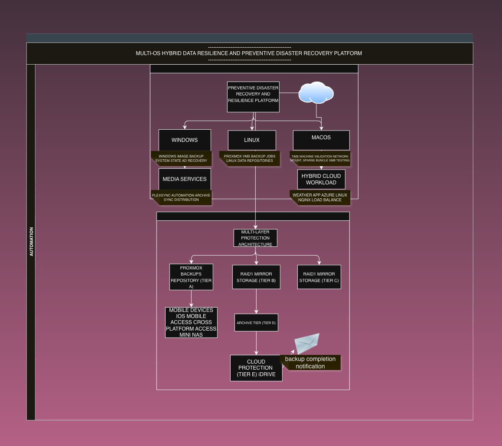

Multi-OS Hybrid Data Resilience & Preventive Disaster Recovery Platform illustrating protected workloads, multi-layer protection architecture, archive retention strategies, cloud protection workflows, automation, and operational notification capabilities.

## Overview

The Dev-Ops-08 Multi-OS Hybrid Data Resilience & Preventive Disaster Recovery Platform is a multi-tier protection solution designed to provide automated backup creation, replication, archival storage, recovery readiness, operational continuity, media distribution, cloud protection, and cross-platform disaster recovery capabilities.

The platform protects infrastructure workloads across virtualization platforms, Windows systems, Active Directory services, media repositories, mobile devices, cloud-hosted applications, and cross-platform backup services through a layered architecture consisting of Primary Backup, Replication, Mirror, Archive, and Cloud Protection tiers.

The solution combines backup automation, storage replication, recovery planning, secure access controls, encrypted data workflows, and cloud synchronization into a unified resilience strategy focused on operational continuity and recoverability.

The platform supports Windows, Linux, macOS, iOS, virtualized workloads, cloud-hosted applications, media services, and recovery assets through a structured lifecycle that emphasizes resilience, recovery validation, layered protection, and long-term retention.

By integrating backup operations, archive management, cloud disaster recovery, cross-platform validation, media distribution automation, and operational awareness into a single architecture, the platform evolved beyond traditional backup administration into a comprehensive resilience engineering initiative.

### Beyond Traditional Backups

While the platform originated as a backup and data protection initiative, it evolved into a preventive disaster recovery and resilience platform.

The architecture focuses not only on recovering from failures, but on reducing the likelihood and impact of operational disruptions through layered protection strategies. These include backup validation, archive retention, RAID-based redundancy, cloud protection, recovery readiness, cross-platform compatibility testing, media distribution automation, and hybrid workload resilience across on-premises and cloud-hosted infrastructure.

Rather than relying on a single recovery mechanism, the platform incorporates multiple resilience layers designed to maintain operational continuity and preserve recovery options when infrastructure, storage systems, applications, or services experience failure.

---

## Portfolio Relationship

Multi-OS Hybrid Data Resilience & Preventive Disaster Recovery Platform builds upon capabilities developed throughout earlier portfolio projects and serves as the primary data protection layer for on-premises and cloud-hosted workloads.

The platform complements the Dev-Ops-06 Hybrid Infrastructure Recovery Automation Platform, which focuses on automated service recovery, post-outage validation, recovery orchestration, WireGuard recovery validation, Orbit/Fleet recovery workflows, webhook integration, and operational health verification.

Together, Dev-Ops-06 and Dev-Ops-08 form a broader resilience strategy that combines infrastructure recovery automation with multi-tier data protection, archive retention, cloud protection, and disaster recovery readiness.

### Related Projects

- Dev-Ops-01 Secure Remote Operations Platform
- Dev-Ops-02 Multi-OS Automation Platform
- Dev-Ops-05 Infrastructure Recovery Automation Platform
- Dev-Ops-09 Security Station Deployment & Recovery Platform

### Portfolio Progression

```text
Secure Remote Operations
        ↓
Multi-OS Automation
        ↓
Infrastructure Recovery
        ↓
Hybrid Data Resilience & Recovery
        ↓
Security Station Deployment & Recovery

---

## Project Origin

The project originated from the need to improve backup reliability, recovery readiness, and long-term data protection across multiple infrastructure platforms and services.

What began as an effort to organize and improve backup operations evolved into a comprehensive resilience platform responsible for protecting virtual machines, directory services, media repositories, cloud-hosted workloads, mobile devices, and recovery assets.

As development progressed, several architectural opportunities were identified:

- Consolidation of backup repositories
- Standardization of storage layouts
- Archive-based recovery workflows
- Offsite cloud protection
- Cross-platform backup support
- Encrypted document protection
- Automated media distribution
- Recovery validation processes

The resulting platform expanded beyond traditional backup operations and became a hybrid resilience architecture focused on operational continuity, recoverability, and long-term protection of critical workloads.

### Business Need

- Improve recoverability of critical services.
- Reduce operational risk.
- Protect infrastructure workloads.
- Standardize backup and archive workflows.
- Implement offsite disaster recovery capabilities.
- Improve confidence in recovery operations.

### Technical Challenges

- Multi-tier storage architecture
- Backup orchestration
- Archive management
- Recovery validation
- Cross-platform compatibility
- Secure storage design
- Cloud integration
- Data distribution workflows

### Operational Problems

- Disparate backup repositories
- Inconsistent storage organization
- Limited recovery validation
- Archive management complexity
- Growth of protected workloads
- Need for centralized protection strategy

### Learning Objectives

- Backup engineering
- Recovery engineering
- Storage architecture
- Disaster recovery planning
- Cross-platform integration
- Secure storage design
- Root cause analysis
- Automation design

---

## Objectives

### Project Objectives

- Design a hybrid data resilience architecture.
- Implement automated backup creation.
- Establish replication and archive storage tiers.
- Protect directory services through System State backups.
- Implement cloud-based disaster recovery protection.
- Support cross-platform backup workloads.
- Develop secure encrypted storage workflows.
- Automate media distribution workflows.
- Validate recovery procedures and backup integrity.

### Success Criteria

- Multi-tier backup architecture
- Replication automation
- Archive validation
- Cloud protection
- Recovery validation
- Secure storage implementation
- Time Machine validation
- Media distribution automation

---

## Environment

### Infrastructure Components

#### Virtualization

- Proxmox Virtual Environment
- Virtual Machine Backups
- Configuration Backup Repositories

#### Backup Infrastructure

- Primary Backup Tier
- Replication Storage Tier
- Archive Storage Tier
- Cloud Protection Tier

#### Recovery Services

- Directory Services
- DNS
- System State Recovery
- Archive-Based Recovery

#### Media Services

- Media Repository
- Automated Media Distribution
- Plex Library Synchronization

#### Cloud Services

- Cloud Backup Storage
- Cloud-Hosted Weather Application
- Offsite Disaster Recovery
- Hybrid Workload Protection

#### Security Services

- Secure SMB Storage
- Authentication Services
- Encrypted Storage Containers

### Operating Systems

- Windows Server
- Fedora Linux
- Proxmox VE
- macOS
- iOS

### Protected Workloads

- Virtual Machines
- System Images
- Configuration Backups
- Directory Services
- DNS Services
- Mobile Device Data
- Media Repositories
- Time Machine Backups
- Cloud-Hosted Weather Application
- Encrypted Document Repositories
- Media Distribution Services
---

## Technology Stack

### Infrastructure

- Proxmox VE
- Hyper-V
- Windows Server
- Fedora Linux

### Backup & Recovery

- Proxmox Backup
- Windows Server Backup
- wbadmin
- Apple Time Machine

### Storage

- RAID1
- SMB/CIFS
- Samba
- rsync
- Robocopy

### Automation

- PowerShell
- Bash
- Scheduled Tasks
- Cron
- Ansible

### Security

- Samba Authentication
- Linux File Permissions
- VeraCrypt

### Networking

- SMB
- CIFS
- WinRM
- SSH

### Media Distribution

- Plex
- PlexSync.ps1
- Robocopy

### Cloud

- iDrive
- Cloud-Hosted Weather Application

### Cross-Platform Services

- Windows
- Linux
- macOS
- iOS

---

## Architecture
### Design Goals

The platform was designed to provide a resilient, automated, and scalable approach to protecting infrastructure, services, and data across multiple storage tiers and operational environments.

Key design goals included:

- Eliminate single points of failure through layered storage protection.
- Separate backup, replication, archive, and cloud protection functions.
- Automate recurring backup and replication operations.
- Improve recovery readiness through validated recovery workflows.
- Protect both on-premises and cloud-hosted workloads.
- Support cross-platform systems and services.
- Provide secure storage capabilities for sensitive data.
- Enable centralized archive management and media distribution.
- Maintain operational simplicity while increasing recoverability.
- Create a repeatable architecture that can scale with future workloads.

The resulting architecture evolved from a traditional backup platform into a hybrid resilience platform capable of protecting infrastructure services, directory services, media repositories, cloud-hosted applications, mobile devices, and cross-platform backup workloads through a unified protection strategy.

### Hybrid Service Protection

In addition to protecting traditional infrastructure workloads, the platform also provides protection for cloud-hosted services.

A cloud-hosted Weather Application was incorporated into the protection strategy as a hybrid workload. The application leveraged NGINX as part of the web delivery pipeline and demonstrated protection requirements beyond traditional backup repositories.

The Weather Application became an example of how the platform supports operational resilience for services hosted outside the local infrastructure while still incorporating backup, recovery, and archive planning.

#### Weather Application Pipeline

```text
Weather Data Sources
        ↓

Weather Application

        ↓

NGINX Reverse Proxy

        ↓

Public Service Delivery

        ↓

Backup & Recovery Strategy

        ↓

Archive Protection

        ↓

Cloud Protection
```

### Architecture Components

#### Tier A - Primary Backup Tier

The Primary Backup Tier serves as the initial backup destination for protected workloads and acts as the first stage of the resilience pipeline.

Primary functions include:

- Virtual machine backups
- System image backups
- Backup staging
- Initial backup retention

---

#### Tier B - Replication Storage Tier

The Replication Storage Tier provides a secondary storage location for backup data and serves as the primary replication target.

Primary functions include:

- Backup replication
- Storage consolidation
- Media repository protection
- Configuration backup storage

---

#### Tier C - Mirror Storage Tier

The Mirror Storage Tier provides hardware redundancy through RAID mirroring and protects against individual disk failures.

Primary functions include:

- Hardware redundancy
- Storage resilience
- Replication protection

---

#### Tier D - Archive Storage Tier

The Archive Storage Tier serves as the long-term archive repository and recovery tier for protected data.

Primary functions include:

- Archive retention
- Recovery repositories
- Directory service protection
- Historical backup storage
- Media archive storage

---

#### Tier E - Cloud Protection Tier

The Cloud Protection Tier provides offsite disaster recovery protection and serves as the final layer of the resilience architecture.

Primary functions include:

- Offsite backup protection
- Disaster recovery storage
- Cloud-based resilience
- Geographic separation

### Protection Workflow

The platform uses a layered protection strategy that separates backup creation, replication, archive management, and cloud protection into distinct operational stages.

```text
Virtual Machines
Windows Systems
Directory Services
Mobile Devices
Media Repositories
Time Machine
Cloud Applications
Encrypted Documents

        ↓

Tier A
Primary Backup Tier

        ↓

Tier B
Replication Storage Tier

        ↓

Tier C
Mirror Storage Tier

        ↓

Tier D
Archive Storage Tier

        ↓

Tier E
Cloud Protection Tier
```

This design ensures that protected data progresses through multiple resilience layers before reaching offsite protection, reducing the impact of storage failures, operational mistakes, and localized outages.

### Weekly Operational Schedule

The platform operates through a staged automation lifecycle designed to separate backup creation, replication, archival storage, and cloud protection activities.

```text
SUNDAY
═══════════════════════════════════════

00:00
System State Backup

00:00
Virtual Machine Backup Job #1

04:00
Virtual Machine Backup Job #2


MONDAY
═══════════════════════════════════════

02:00
Primary Backup Tier
        ↓
Replication Storage Tier

04:00
Replication Storage Tier
        ↓
Archive Storage Tier


TUESDAY
═══════════════════════════════════════

02:00
Archive Storage Tier
        ↓
Cloud Protection Tier
```

Operational Lifecycle

```text
Sunday
Backup Creation

Monday
Replication
Archive Creation

Tuesday
Cloud Protection
```
### Protected Workloads

The platform was designed to protect a diverse set of workloads spanning infrastructure services, user data, media repositories, cloud-hosted applications, and recovery assets.

Protected workloads include:

- Virtual machine backups
- System image backups
- Configuration backup repositories
- Directory services
- DNS services
- System State backups
- Mobile device data
- Media repositories
- Apple Time Machine backups
- Cloud-hosted Weather Application
- Encrypted document repositories
- Media distribution services

The inclusion of both on-premises and cloud-hosted workloads reinforces the platform's hybrid design philosophy and supports a unified resilience strategy across multiple operational environments.


### Media Distribution Workflow

In addition to backup and recovery operations, the platform provides automated media distribution capabilities through a PowerShell-based synchronization workflow.

Curated media content is replicated from archive storage into Plex libraries using reusable source-to-destination mappings and Robocopy-based incremental synchronization.

```text
Media Repository
        ↓

Archive Media Storage
        ↓

PlexSync.ps1
        ↓

Media Library Repository
        ↓

Plex Libraries
```

The workflow reduces administrative overhead while ensuring media libraries remain synchronized with archived content.

Key capabilities include:

- Reusable source-to-destination mappings
- Incremental synchronization
- Automated media distribution
- Centralized archive management
- Simplified library expansion

### Secure Storage Workflow

The platform incorporates secure storage capabilities designed to protect sensitive information through authenticated access controls and encrypted storage workflows.

Protection mechanisms include:

- Authenticated SMB access
- User-based authorization controls
- Linux permission enforcement
- Encrypted document storage
- VeraCrypt container protection

Secure storage workflows were designed to separate authentication, authorization, and encryption responsibilities while maintaining operational simplicity.

```text
Sensitive Documents
        ↓

Encrypted Container
        ↓

Replication Tier
        ↓

Archive Tier
        ↓

Cloud Protection Tier
```

This design allows encrypted data to participate in the same resilience architecture as other protected workloads without exposing sensitive information during backup and replication operations.

### Resilience Ecosystem

The platform evolved beyond traditional backup operations into a resilience ecosystem designed to protect infrastructure services, user data, media repositories, cloud-hosted workloads, and recovery assets through multiple protection layers.

```text
Virtual Infrastructure
            │
Active Directory
            │
DNS Services
            │
Windows Systems
            │
Mobile Devices
            │
Time Machine
            │
Media Repositories
            │
Weather Application
            ▼

     Primary Backup Tier
                │
                ▼

   Replication Storage Tier
                │
                ▼

      Mirror Storage Tier
                │
                ▼

      Archive Storage Tier
          ├──────────────┐
          │              │
          ▼              ▼

 Recovery Assets   Media Distribution
     │                  │
     ▼                  ▼

 Disaster Recovery   Plex Libraries
          │
          ▼

   Cloud Protection Tier
```

This architecture ensures that protected workloads are not limited to a single backup destination and instead participate in a staged resilience lifecycle designed to support recovery, archival retention, media distribution, and cloud-based disaster recovery.

---

## Implementation

### Phase 1 - Architecture Audit & Validation

The project began with a comprehensive review of existing backup repositories, storage locations, retention workflows, and recovery capabilities.

Initial analysis revealed that backup data existed across multiple systems and storage locations but lacked a clearly documented resilience architecture defining how backups progressed from creation through retention, archival storage, and cloud protection.

Activities performed during this phase included:

- Auditing backup repositories and storage locations.
- Reviewing virtual machine backup workflows.
- Reviewing Windows backup workflows.
- Validating archive repositories and storage utilization.
- Identifying recovery dependencies.
- Mapping data flows between backup systems.
- Defining the initial resilience architecture.

The review established the foundation for the platform's multi-tier design and identified opportunities for storage standardization, archive consolidation, automation improvements, and recovery validation.

#### Outcome

- Established baseline architecture.
- Identified protected workloads.
- Defined resilience tiers.
- Documented backup and recovery dependencies.
- Created the foundation for the Multi-OS Hybrid Data Resilience & Preventive Disaster Recovery Platform.

### Phase 2 - Storage Standardization

Following the architectural review, storage repositories were standardized to improve consistency, simplify management, and support long-term resilience objectives.

Existing storage structures were reviewed and reorganized to create a more predictable hierarchy for backup repositories, media archives, configuration backups, and recovery assets.

Activities performed during this phase included:

- Standardizing backup repository layouts.
- Reviewing RAID storage organization.
- Consolidating archive structures.
- Validating replication targets.
- Organizing configuration backup repositories.
- Reviewing media storage workflows.

Storage standardization improved visibility across the platform and provided a consistent structure for backup creation, replication, archive management, and recovery operations.

#### Outcome

- Standardized storage architecture.
- Improved repository organization.
- Simplified backup management.
- Improved operational consistency.
- Established a scalable foundation for archive growth.

### Phase 3 - Archive Tier Deployment

As backup repositories and replication workflows matured, a dedicated archive tier was implemented to provide long-term storage, recovery capability, and centralized management of protected data.

The archive tier became the platform's primary recovery repository and served as the destination for replicated backup data, media archives, configuration backups, and historical recovery assets.

Activities performed during this phase included:

- Designing the archive storage hierarchy.
- Organizing backup repositories.
- Validating archive replication workflows.
- Establishing long-term retention locations.
- Reviewing archive recovery procedures.
- Consolidating protected workloads into a centralized archive strategy.

The archive tier transformed the platform from a collection of backup repositories into a structured resilience architecture capable of supporting recovery operations across multiple workload types.

#### Outcome

- Established dedicated archive storage.
- Centralized recovery repositories.
- Improved recovery readiness.
- Simplified long-term backup management.
- Created the foundation for cloud protection workflows.

### Phase 4 - Recovery Protection

Recovery protection capabilities were expanded to improve resilience for critical infrastructure services and ensure recoverability of operational systems.

Particular emphasis was placed on protecting directory services, DNS configurations, and system state information required for infrastructure recovery.

Activities performed during this phase included:

- Implementing System State backup workflows.
- Validating recovery repositories.
- Reviewing recovery procedures.
- Protecting directory service dependencies.
- Protecting DNS service data.
- Verifying scheduled recovery protection jobs.

Recovery planning became a core component of the platform and ensured that protected workloads could be restored using validated backup artifacts rather than assumptions.

#### Outcome

- Improved infrastructure recoverability.
- Protected critical service dependencies.
- Validated recovery workflows.
- Increased operational resilience.
- Strengthened disaster recovery readiness.

### Phase 5 - Security Hardening

As the platform expanded, additional controls were implemented to secure access to protected data and archive repositories.

During review and testing, it became apparent that storage workflows relied heavily on administrative access rather than a dedicated user access model. This led to the implementation of authenticated access controls and improved separation between administrative and day-to-day operations.

Activities performed during this phase included:

- Implementing authenticated SMB access.
- Creating dedicated storage access accounts.
- Validating authentication workflows.
- Enforcing Linux file permissions.
- Restricting access to authorized users.
- Testing cross-platform access from Linux and Windows systems.

These improvements strengthened the platform's security posture without impacting backup, archive, or recovery workflows.

#### Outcome

- Authenticated storage access.
- Improved access control.
- User separation for operational activities.
- Secure archive access.
- Improved protection of sensitive data.

### Phase 6 - Encryption Strategy

Following the implementation of authenticated storage controls, attention shifted toward protecting sensitive information through encryption.

Rather than introducing automation that required encryption secrets to be stored within management tools, the platform adopted a strategy focused on protecting encrypted containers as backup artifacts.

Activities performed during this phase included:

- Reviewing encrypted storage requirements.
- Evaluating VeraCrypt integration options.
- Designing encrypted document workflows.
- Reviewing backup compatibility with encrypted data.
- Simplifying recovery processes through container-based protection.

The resulting design allowed encrypted data to participate in the platform's backup, archive, replication, and cloud protection workflows without exposing encryption credentials to automation systems.

#### Outcome

- Encrypted document protection strategy.
- Simplified recovery workflow.
- Separation of backup and encryption responsibilities.
- Improved protection for sensitive information.
- Reduced operational complexity.

### Phase 7 - Backup Optimization

Backup operations were reviewed after intermittent failures were observed during scheduled virtual machine backup execution.

An investigation was performed to determine whether the issue originated from storage infrastructure, backup repositories, or scheduler behavior.

Activities performed during this phase included:

- Reviewing backup scheduler logs.
- Verifying repository health.
- Validating storage availability.
- Analyzing backup execution timelines.
- Reviewing job schedules.
- Performing manual backup validation.

The investigation determined that backup failures were caused by overlapping backup schedules rather than infrastructure or repository failures.

Schedules were adjusted to provide additional operational separation between backup jobs and eliminate future collisions.

#### Outcome

- Root cause identified.
- Backup schedules optimized.
- Repository health validated.
- Protected workload coverage restored.
- Improved operational reliability.

### Phase 8 - Cross-Platform Backup Validation

Cross-platform backup functionality was evaluated to ensure compatibility across Linux, Windows, macOS, and mobile device workflows.

Particular attention was given to Apple Time Machine support due to its unique storage requirements and integration with SMB-based storage.

Activities performed during this phase included:

- Validating Time Machine discovery.
- Validating Time Machine mounting.
- Verifying sparsebundle creation.
- Reviewing backup progress and data transfer.
- Performing compatibility testing.
- Conducting root cause analysis on observed limitations.

Testing successfully demonstrated cross-platform integration while also revealing storage-layer behavior that influenced long-term implementation planning.

The resulting investigation became one of the platform's most valuable engineering exercises and reinforced the importance of validating backup technologies under real operating conditions rather than relying solely on documentation.

#### Outcome

- Successful Time Machine validation.
- Sparsebundle creation confirmed.
- Cross-platform compatibility validated.
- Root cause analysis completed.
- Future implementation path identified.

### Phase 9 - Media Distribution Automation

As the archive platform matured, media distribution requirements were incorporated into the resilience architecture to simplify library management and eliminate manual synchronization tasks.

Rather than managing individual media repositories separately, the platform adopted a centralized archive model where curated content could be distributed automatically to downstream media services.

Activities performed during this phase included:

- Reviewing media storage workflows.
- Designing archive-to-library synchronization processes.
- Developing PowerShell automation.
- Implementing reusable source-to-destination mappings.
- Validating incremental synchronization behavior.
- Testing media distribution workflows.

The resulting design leveraged PowerShell and Robocopy to synchronize archived media content into media library locations using a reusable job-based architecture.

```text
Media Repository
        ↓

Archive Media Storage
        ↓

PlexSync.ps1
        ↓

Media Library Repository
        ↓

Plex Libraries
```

This approach provided centralized content management while maintaining a simple and repeatable automation framework.

#### Outcome

- Automated media synchronization.
- Centralized archive management.
- Reduced administrative effort.
- Reusable automation workflows.
- Simplified media library expansion.

### Phase 10 - Final Architecture Validation

The final phase focused on validating the complete resilience architecture and confirming the successful operation of backup, replication, archive, recovery, security, media distribution, and cloud protection workflows.

Each tier of the platform was reviewed to ensure that protected workloads progressed through the intended resilience lifecycle without manual intervention.

Activities performed during this phase included:

- Validating backup creation workflows.
- Validating replication workflows.
- Validating archive storage operations.
- Validating System State protection.
- Reviewing cloud protection schedules.
- Validating media distribution workflows.
- Reviewing secure storage workflows.
- Confirming hybrid workload protection.

The review demonstrated that the platform had evolved beyond a traditional backup solution into a hybrid resilience architecture supporting infrastructure services, cloud-hosted workloads, recovery operations, encrypted data workflows, and media distribution services.

#### Outcome

- Multi-tier resilience architecture validated.
- Recovery protection validated.
- Archive platform validated.
- Media distribution validated.
- Cloud protection validated.
- Cross-platform backup capabilities validated.
- Hybrid workload protection validated.
- Dev-Ops-08 Multi-OS Hybrid Data Resilience & Preventive Disaster Recovery Platform completed.
---

## Automation

Automation is a foundational component of the platform and enables backup creation, replication, archival storage, media distribution, recovery protection, and cloud synchronization without routine manual intervention.

### Backup Lifecycle

The platform follows a structured protection lifecycle designed to ensure that data progresses through multiple resilience tiers before reaching offsite storage.

```text
Create
    ↓
Replicate
    ↓
Archive
    ↓
Protect
    ↓
Recover
```

This lifecycle provides layered protection while reducing operational overhead through scheduled automation.

---

### Replication Workflows

Replication workflows move protected data between resilience tiers and ensure that backup repositories are duplicated before archival storage and cloud protection occur.

```text
Primary Backup Tier
        ↓
Replication Storage Tier
        ↓
Archive Storage Tier
```

Benefits include:

- Reduced single points of failure
- Improved recovery readiness
- Increased storage resilience
- Long-term archive protection

---

### Archive Workflows

Archive workflows provide centralized storage for backup repositories, recovery assets, media content, configuration backups, and historical backup artifacts.

```text
Backup Repositories
        ↓
Archive Storage
        ↓
Recovery Assets
```

Archive storage serves as the platform's primary recovery repository.

---

### Cloud Protection

Cloud protection provides the final resilience layer and ensures critical backup data exists outside the local infrastructure.

```text
Archive Storage Tier
        ↓
Cloud Protection Tier
```

Benefits include:

- Offsite disaster recovery
- Additional resilience layer
- Protection from localized failures
- Long-term recovery capability

---

### Media Distribution Workflow

The platform includes automated media synchronization through a PowerShell-based distribution workflow.

```text
Media Repository
        ↓
Archive Media Storage
        ↓
PlexSync.ps1
        ↓
Media Libraries
```

Automation capabilities include:

- Reusable source-to-destination mappings
- Incremental synchronization
- Centralized content management
- Simplified library expansion

---

### Example Schedules

The platform uses a staggered schedule to separate backup creation, replication, archive creation, and cloud protection activities.

```text
Sunday
Backup Creation

Monday
Replication
Archive Creation

Tuesday
Cloud Protection
```

This schedule minimizes workflow conflicts while ensuring data progresses through all resilience stages.

---

## Validation

The platform was validated across infrastructure, backup, recovery, security, cloud, automation, and cross-platform workflows to ensure operational readiness and recoverability.

### Infrastructure Validation

Infrastructure validation confirmed successful operation of the platform's resilience architecture and supporting storage services.

Validation activities included:

- Backup repository verification
- Archive repository verification
- Storage replication verification
- Archive workflow verification
- Repository accessibility validation
- Recovery repository validation

#### Results

✅ Multi-tier architecture validated

✅ Archive tier operational

✅ Replication workflows operational

✅ Recovery repositories validated

---

### Backup Validation

Backup validation focused on confirming successful creation, storage, and retention of protected workloads.

Validation activities included:

- Virtual machine backup verification
- Configuration backup verification
- System image backup verification
- Backup repository review
- Backup schedule validation

#### Results

✅ Virtual machine backups validated

✅ Backup repositories validated

✅ Backup schedules validated

✅ Protected workloads successfully backed up

---

### Recovery Validation

Recovery validation focused on ensuring recovery assets existed and could be used to support operational recovery scenarios.

Validation activities included:

- System State backup verification
- Archive recovery validation
- Recovery repository review
- Dependency identification
- Recovery workflow testing

#### Results

✅ Recovery workflows validated

✅ Recovery repositories validated

✅ System State protection validated

✅ Recovery readiness improved

---

### Security Validation

Security validation confirmed authenticated access controls, storage protections, and secure storage workflows.

Validation activities included:

- Authenticated SMB access testing
- User authorization validation
- Linux permission validation
- Cross-platform access testing
- Secure storage verification

#### Results

✅ Authenticated access validated

✅ User permissions validated

✅ Secure storage operational

✅ Access controls verified

---

### Cloud Validation

Cloud validation confirmed the operation of offsite protection workflows and hybrid protection strategy components.

Validation activities included:

- Cloud synchronization review
- Archive-to-cloud workflow validation
- Protection schedule review
- Hybrid workload protection review

#### Results

✅ Cloud protection validated

✅ Offsite protection operational

✅ Hybrid workload protection validated

---

### Cross-Platform Validation

Cross-platform validation ensured compatibility across supported operating systems and endpoint types.

Validation activities included:

- Windows testing
- Linux testing
- macOS testing
- Mobile device testing
- Time Machine testing

#### Results

✅ Windows compatibility validated

✅ Linux compatibility validated

✅ macOS compatibility validated

✅ Mobile access validated

✅ Time Machine validation successful

---

### Automation Validation

Automation validation verified the operation of scheduled workflows responsible for backup creation, replication, archive management, cloud synchronization, and media distribution.

Validation activities included:

- Scheduled backup validation
- Replication workflow validation
- Archive workflow validation
- Cloud workflow validation
- Media synchronization validation

#### Results

✅ Backup automation validated

✅ Replication automation validated

✅ Archive automation validated

✅ Cloud automation validated

✅ Media distribution automation validated

---

### Outcome

Validation confirmed successful operation of the Multi-OS Hybrid Data Resilience & Preventive Disaster Recovery Platform across backup creation.

The platform successfully evolved into a comprehensive resilience architecture providing layered protection for infrastructure services, user data, media repositories, cloud-hosted workloads, and recovery assets.

---

## Root Cause Analyses

### RCA-001 Time Machine CIFS/exFAT Investigation

#### Summary

During cross-platform backup validation, Apple Time Machine support was evaluated using SMB-based storage hosted within the platform's resilience architecture.

Initial testing appeared successful and confirmed that Time Machine could discover the backup target, mount the share, create a sparsebundle, and begin transferring backup data.

#### Observed Behavior

Validation confirmed:

- Time Machine share discovery
- Authentication and access
- Share mounting
- Sparsebundle creation
- Initial backup activity
- Data transfer operations

Although initial testing succeeded, additional investigation revealed storage-layer limitations that affected long-term suitability for production Time Machine workloads.

#### Investigation Activities

- Reviewed SMB configuration
- Reviewed Time Machine requirements
- Validated sparsebundle creation
- Monitored backup progress
- Investigated filesystem behavior
- Performed cross-platform testing

#### Root Cause

The observed limitation was determined to be related to the interaction between Time Machine requirements and the underlying storage implementation rather than SMB authentication or backup application functionality.

The investigation demonstrated the importance of validating backup solutions under realistic operating conditions instead of relying solely on configuration guidance.

#### Outcome

✅ Time Machine discovery validated

✅ Share mounting validated

✅ Sparsebundle creation validated

✅ Data transfer validated

✅ Root cause identified

✅ Future implementation path documented

#### Lesson Learned

Backup compatibility depends on both application configuration and underlying storage architecture. Successful connectivity testing alone does not guarantee long-term operational suitability.

### RCA-002 Proxmox Backup Schedule Collision

#### Summary

During routine validation, scheduled virtual machine backups reported storage activation failure messages.

Initial concern suggested a possible issue involving backup repositories, storage availability, or repository accessibility.

#### Observed Behavior

Backup jobs reported storage activation failures despite the apparent availability of backup storage resources.

Protected workloads showed inconsistent backup coverage between scheduled jobs.

#### Investigation Activities

- Reviewed scheduler logs
- Verified repository accessibility
- Reviewed backup execution timelines
- Inspected backup schedules
- Validated repository health
- Performed manual backup testing

#### Root Cause

The investigation determined that backup jobs were competing for access to backup resources because multiple scheduled workloads overlapped during execution.

The failures were not caused by repository corruption, storage failures, archive failures, or backup software defects.

Instead, the issue originated from backup schedule timing and workload overlap.

#### Remediation

Backup schedules were adjusted to increase separation between backup operations and eliminate scheduling conflicts.

The revised schedule provided additional execution time and operational buffer between scheduled jobs.

#### Outcome

✅ Root cause identified

✅ Storage health validated

✅ Backup repositories validated

✅ Schedule conflict resolved

✅ Backup coverage restored

✅ Reliability improved

### RCA-003 RAID Degradation and Storage Instability

#### Summary

Investigated recurring RAID degradation events impacting the replication tier of the backup platform.

#### Findings

Validated:

- RAID member failure and degraded array behavior.
- Storage recovery procedures.
- Filesystem validation and repair activities.
- RAID synchronization and recovery operations.

#### Root Cause

The investigation determined that storage instability was most likely associated with USB-attached storage reliability factors rather than filesystem corruption, backup software, Linux RAID functionality, or replication workflows.

Contributing factors included:

- USB connectivity instability
- Storage enclosure reliability concerns
- Power-related interruptions
- Device availability fluctuations

#### Resolution

Completed:

- RAID reassembly
- Filesystem validation
- Synchronization recovery
- Storage migration planning
- Backup workflow modernization

#### Outcome

The RAID array was successfully restored to a healthy state and backup workflows were migrated toward a dedicated backup orchestration platform.

#### Lesson Learned

Backup failures should be investigated through logs and execution timelines before making infrastructure changes. Apparent storage failures may originate from workflow design, scheduling conflicts, or operational timing issues.

---

## Screenshots

### Project Structure Validation

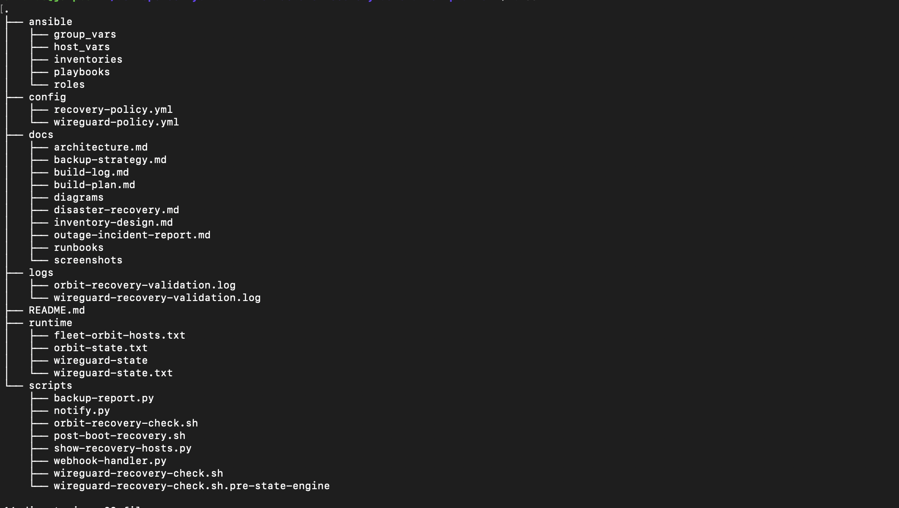

Project structure validation demonstrating the organized repository architecture supporting automation, disaster recovery planning, documentation, configuration management, operational logging, and resilience engineering workflows.

### Archive Storage Tier Structure

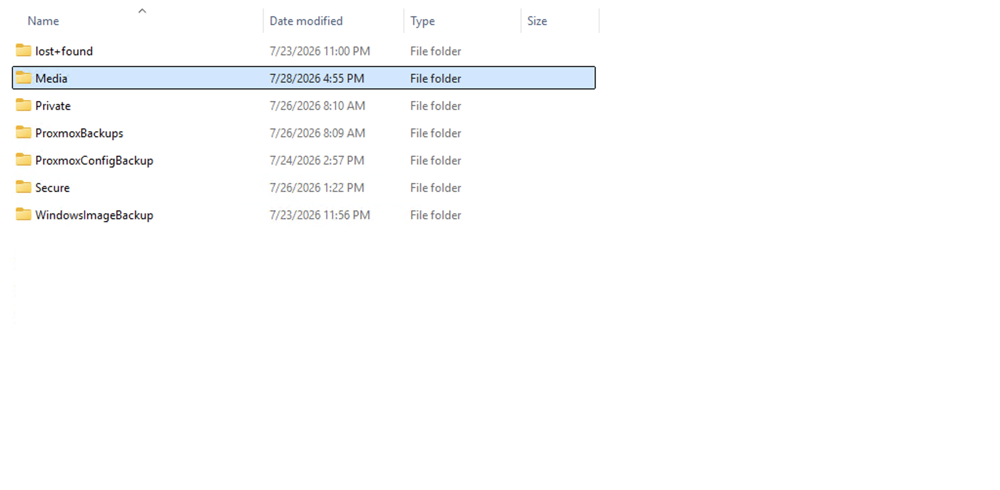

Archive Storage Tier validation demonstrating long-term retention of virtual machine backups, configuration backups, Windows recovery assets, media repositories, and protected archive content supporting disaster recovery and operational continuity objectives.

### Proxmox Backup Job Schedule

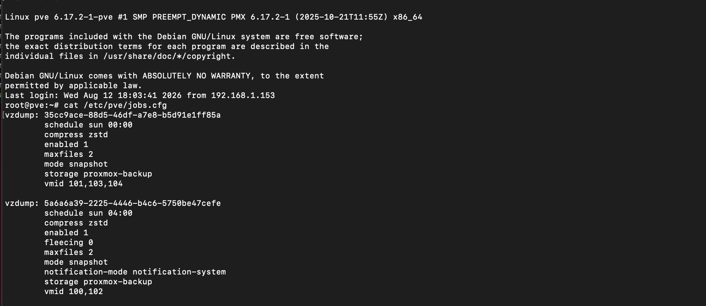

Proxmox backup job configuration showing staggered backup schedules, snapshot-based protection, retention controls, and workload separation. The schedule redesign reduced execution overlap and improved backup reliability following RCA-002 investigation activities.

### Proxmox VM Backup Repository Validation

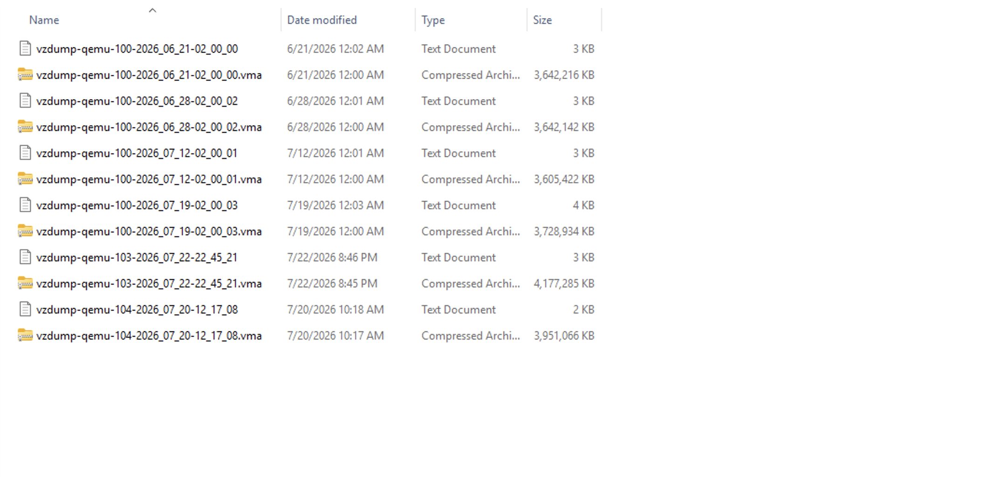

Proxmox backup repository validation demonstrating successful creation, retention, and storage of protected virtual machine recovery assets. Multiple retained backup generations across production workloads validate repository functionality, backup retention policies, and recovery readiness.

### Proxmox Backup Task History

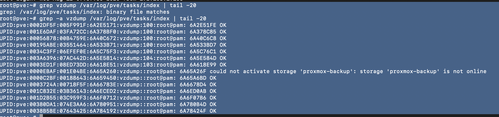

Proxmox backup task history validation demonstrating successful execution of scheduled VM protection workflows across multiple workloads. Historical task records verify backup completion and operational recovery readiness.

### Archive-to-Plex Automation Validation

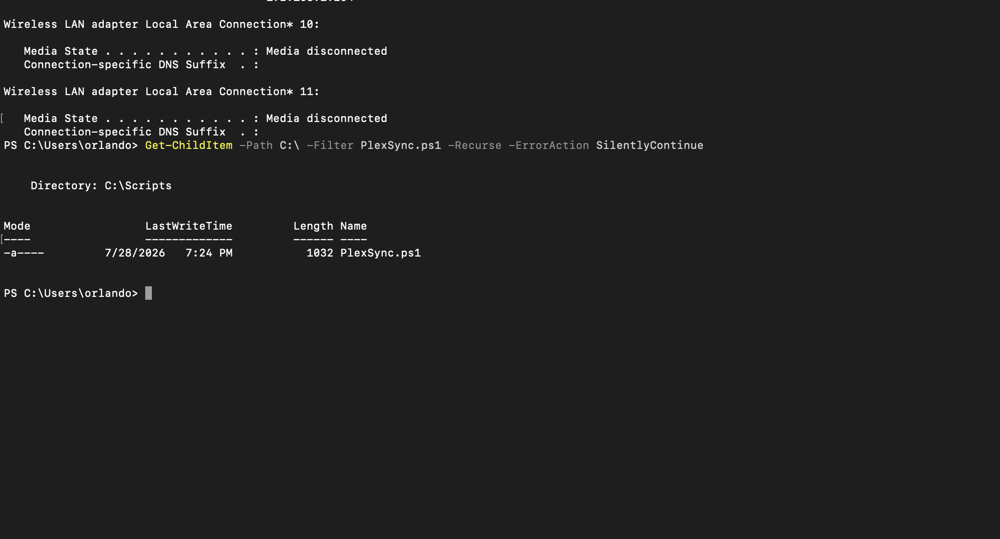

PlexSync automation validation demonstrating media distribution workflows between archive repositories and Plex library locations.

### RAID1 Array Health Validation

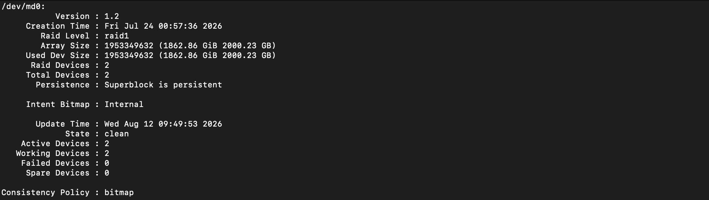

RAID1 array health validation demonstrating synchronized mirror members, clean array status, and fully operational redundant storage. The array provides resilient storage protection for replicated backup data and archive repositories.

### Time Machine Discovery

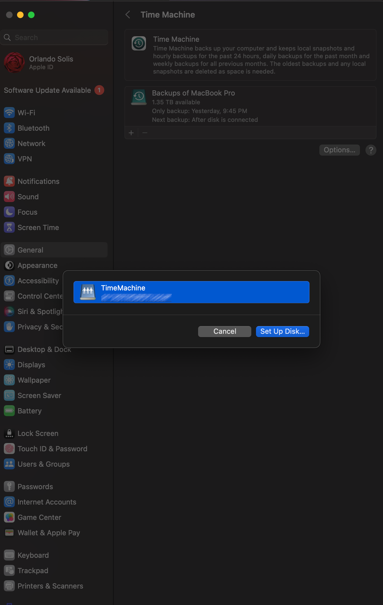

Time Machine discovery validation showing successful identification of the SMB-based backup target during cross-platform backup testing.

### Time Machine Backup Target Registration

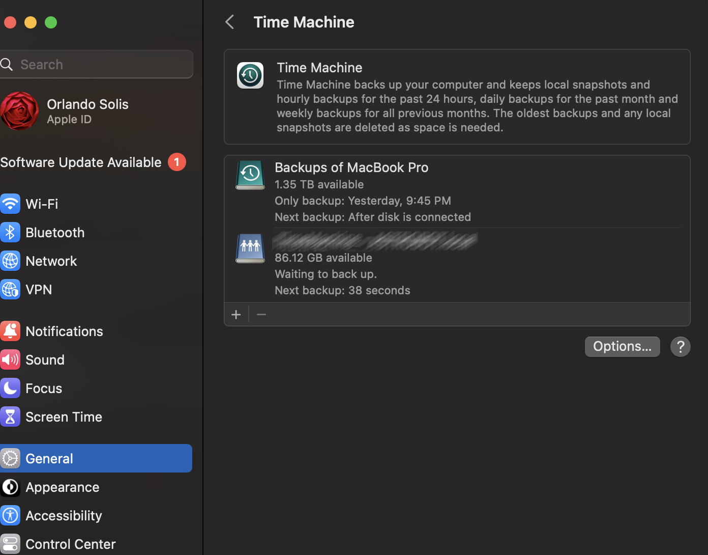

Time Machine destination registration validation demonstrating successful backup target selection, accessibility, and mount operations.

### Time Machine Sparsebundle Creation

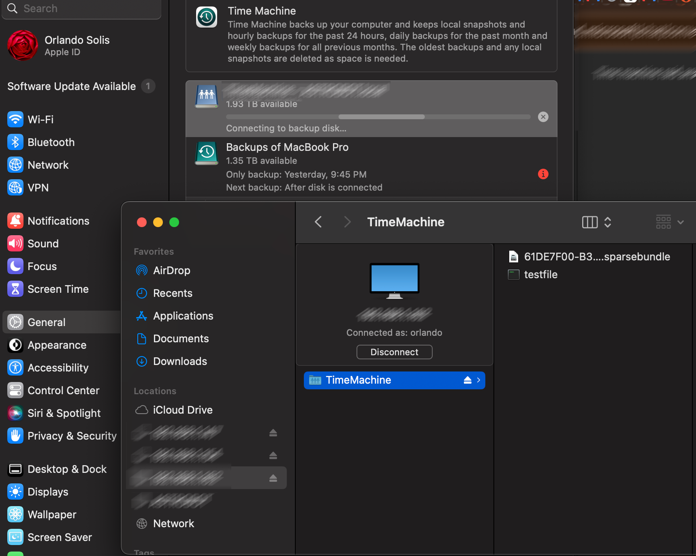

Time Machine sparsebundle creation demonstrating successful initialization of the macOS backup repository and cross-platform backup preparation.

### Time Machine Sparsebundle Validation

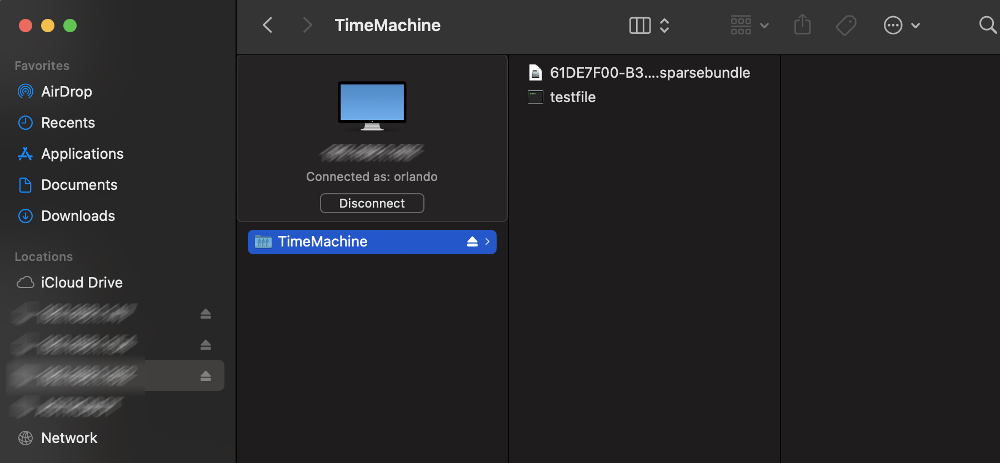

Time Machine sparsebundle validation confirming successful repository creation, accessibility, and readiness for backup operations.

### Time Machine CLI Validation

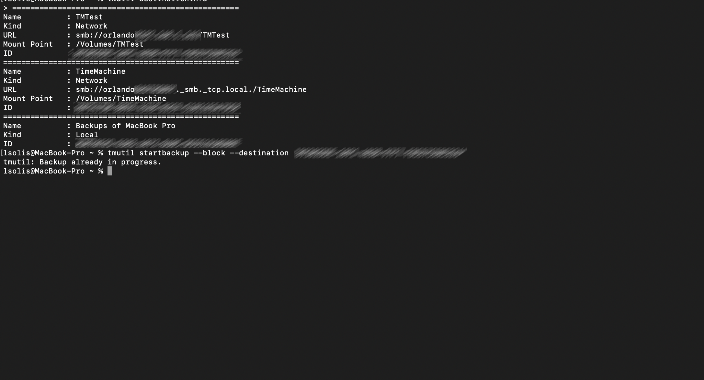

Command-line validation demonstrating successful backup target recognition, mounted storage accessibility, and active backup operation verification.

### Time Machine Archive Integration

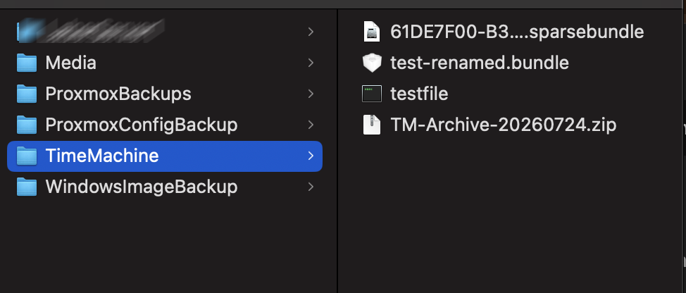

Archive Tier integration validation demonstrating successful incorporation of Time Machine recovery assets into the broader Multi-OS Hybrid Data Resilience & Preventive Disaster Recovery Platform.

### Azure Weather Platform Validation

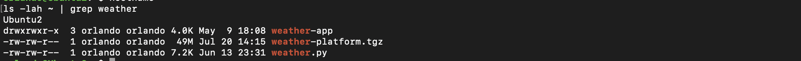

Azure-hosted Weather Application validation demonstrating deployment of hybrid cloud workloads within the platform's protection scope. Repository, application source code, and deployment artifacts validate support for cloud-hosted services beyond traditional backup repositories.

### NGINX Service Validation

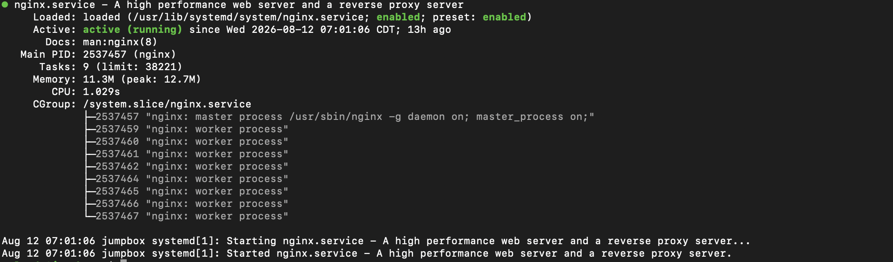

NGINX service validation demonstrating operational reverse proxy services supporting hybrid workload protection and public service delivery. Active service status, enabled startup configuration, and running worker processes validate the web delivery layer supporting cloud-hosted application resilience.

### Cloud Protection Tier

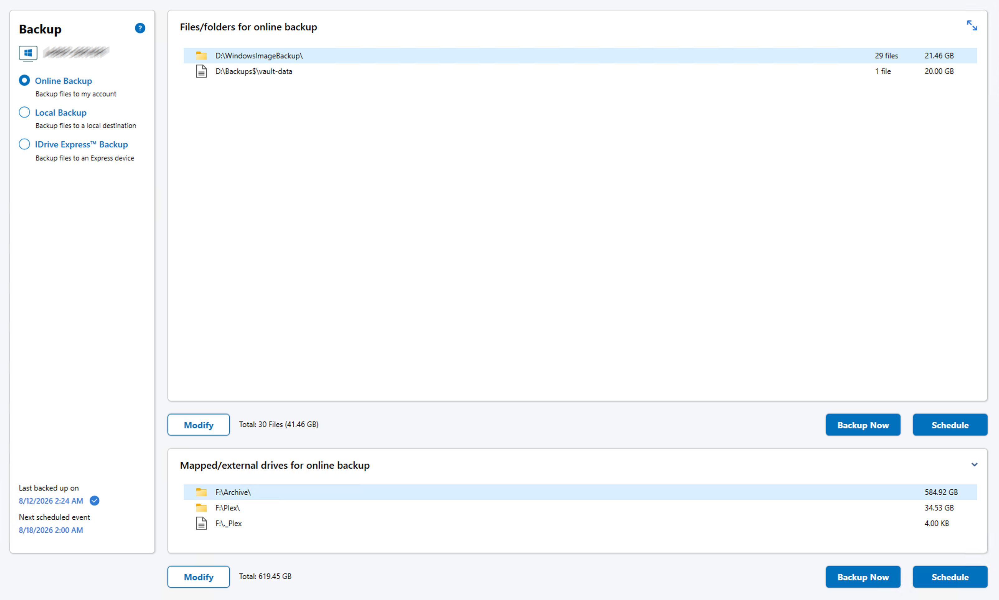

Cloud Protection Tier validation demonstrating scheduled offsite protection of Windows recovery assets, archive repositories, media content, and resilience platform data. The configuration validates disaster recovery capabilities through cloud-based backup retention and geographic separation of recovery assets.

### Cloud Backup Notification

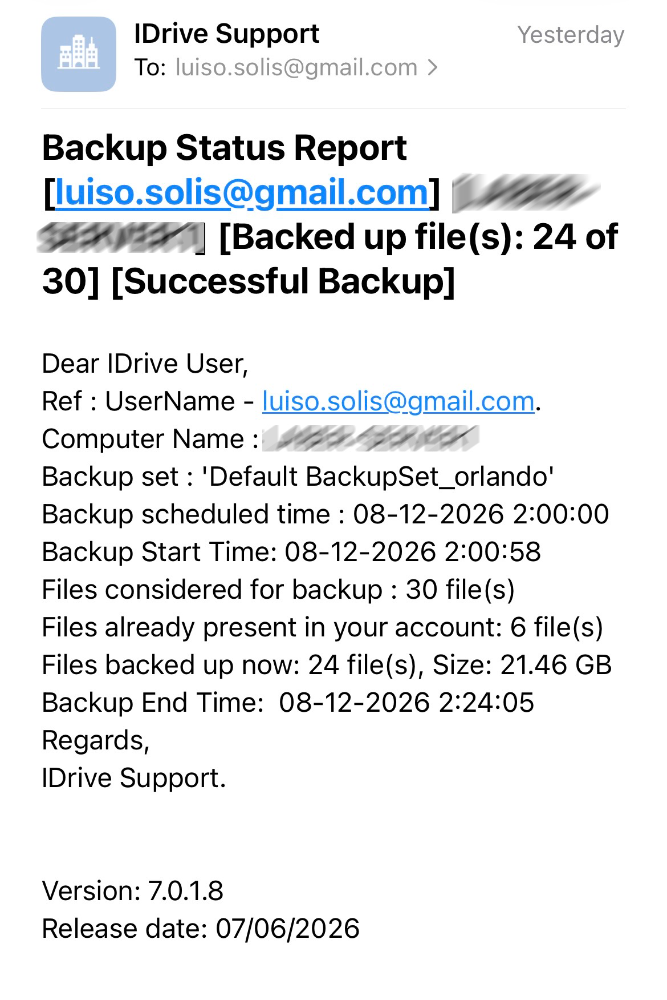

Automated cloud backup notification confirming successful completion of scheduled offsite protection workflows. The notification validates backup execution, administrator awareness, operational visibility, and successful transmission of recovery assets to the Cloud Protection Tier.

---

## Lessons Learned

### Lesson #1 - Architecture Matters

One of the most important lessons learned during the project was that successful backup strategies depend on architecture rather than individual backup jobs.

By separating backup creation, replication, archive storage, and cloud protection into dedicated resilience tiers, the platform evolved into a structured recovery solution capable of supporting long-term operational resilience.

---

### Lesson #2 - Recovery Must Be Validated

A backup only has value if it can support recovery.

Throughout the project, validation activities focused on confirming that backup artifacts, recovery repositories, System State backups, archive workflows, and recovery data were available and usable.

The platform's emphasis on recovery validation improved confidence in disaster recovery readiness and reduced dependence on assumptions.

---

### Lesson #3 - Authentication and Encryption Are Different Problems

Secure access controls and encryption provide different forms of protection and should be treated as separate design requirements.

Authenticated SMB access, user authorization, and Linux file permissions protect access to data, while encrypted storage solutions protect the data itself.

Recognizing the distinction between these controls led to a more effective and simplified secure storage strategy.

---

### Lesson #4 - Storage Backends Matter

Cross-platform backup solutions are heavily influenced by the capabilities of the underlying storage platform.

Time Machine validation demonstrated that successful connectivity and authentication do not automatically guarantee long-term compatibility.

Storage architecture decisions can directly influence backup reliability, scalability, and operational success.

---

### Lesson #5 - Root Cause Analysis Prevents Bad Fixes

Initial symptoms do not always reveal the true cause of an issue.

The backup schedule collision investigation demonstrated that apparent storage failures can originate from workflow timing and operational design rather than infrastructure faults.

Methodical investigation, log analysis, and validation testing prevented unnecessary remediation efforts and led to a more reliable solution.

---

## Key Outcomes

- RAID recovery successfully completed.
- RAID1 resiliency restored and validated.
- Backup orchestration migrated to a dedicated backup platform.
- File-sharing services successfully migrated.
- Kubernetes backup workflows integrated.
- System-image protection workflows integrated.
- Backup platform self-protection implemented.
- Backup automation ownership centralized.
- Storage recovery RCA completed and documented.
- Multi-tier resilience architecture implemented.
- Hybrid protection strategy established.
- Recovery-focused platform design validated.
- Active Directory recovery protection implemented.
- System State backup workflows validated.
- Archive tier successfully deployed.
- Cloud protection workflows operational.
- Secure SMB storage implemented.
- Authenticated access controls validated.
- VeraCrypt integration strategy defined.
- Cross-platform backup support validated.
- Time Machine compatibility testing completed.
- Media distribution automation implemented.
- Weather Application protection incorporated into the resilience strategy.
- Backup schedule optimization completed.
- Replication workflows validated.
- Archive workflows validated.
- Root cause analyses completed and documented.
- Operational recovery readiness improved.
- Dev-Ops-08 Multi-OS Hybrid Data Resilience & Preventive Disaster Recovery Platform completed.

---

## Future Enhancements

### Cloud Expansion

- Evaluate additional cloud protection providers.
- Review multi-cloud resilience options.
- Expand offsite recovery capabilities.

### Restore Automation

- Develop automated recovery validation procedures.
- Create recovery testing workflows.
- Standardize restoration runbooks.

### Monitoring & Alerting

- Implement backup health monitoring.
- Create automated failure notifications.
- Improve operational visibility.
- Implement RAID degradation alerting.
- Monitor storage health and synchronization status.
- Detect replication failures automatically.
- Alert on missing backup repository mounts.

### Backup Health Dashboards

- Integrate backup metrics into Grafana.
- Visualize backup lifecycle status.
- Improve reporting capabilities.

### Additional Resilience Testing

- Disaster recovery exercises.
- Archive recovery validation.
- Cloud recovery drills.
- Cross-platform recovery testing.

---

## Example Automation

### Replication Workflow

```text
Primary Backup Tier
        ↓
Replication Storage Tier
        ↓
Archive Storage Tier
        ↓
Cloud Protection Tier
```

This workflow provides layered protection and ensures backup artifacts progress through multiple resilience stages.

---

### Media Distribution Workflow

```text
Media Repository
        ↓
Archive Media Storage
        ↓
PlexSync.ps1
        ↓
Media Library Repository
        ↓
Plex Libraries
```

The PowerShell synchronization workflow automates media distribution using reusable source-to-destination mappings and incremental synchronization.

---

### Secure Storage Workflow

```text
Sensitive Documents
        ↓
Encrypted Container
        ↓
Replication Storage Tier
        ↓
Archive Storage Tier
        ↓
Cloud Protection Tier
```

Encrypted content participates in the same resilience architecture as other protected workloads without exposing encryption credentials.

---

### Recovery Workflow

```text
Protected Workload
        ↓
Backup Repository
        ↓
Archive Repository
        ↓
Recovery Asset
        ↓
Service Restoration
```

The recovery process emphasizes validated recovery assets rather than backup creation alone.
